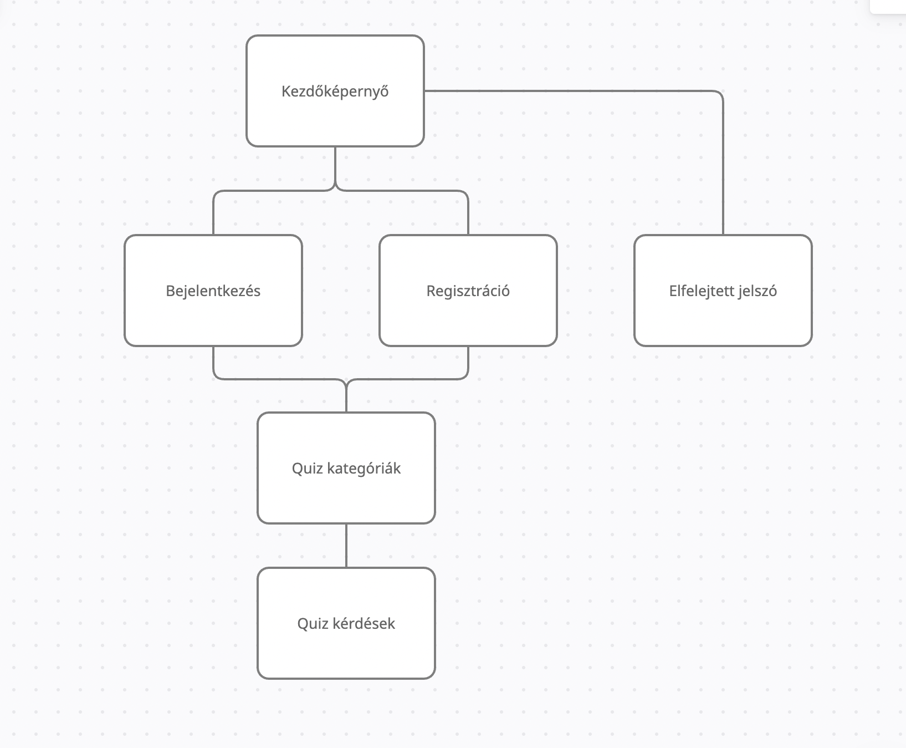

## Rendszerterv

1. #### A rendszer célja
    A **Yoshihiro kft.** megrendelő cég, egy diákokat foglalkoztató vállalat, azzal a megkereséssel fordult software fejlesztő cégönkhöz, hogy szeretne lefejlesztetni egy web alapú quiz programot, amin keresztül a diákok oktatása és fejlődése egy magasabb szintre emelkedhet. 
    A megrendelő cég fő profilja a felsős általános és a gimnazista diákok játékos és könnyed módon való tanítása, oktatása. Szeretnék ha az iskolákban és otthon is tudnának a gyerekekre motiválóan hatni ha a tanulásról van szó. 
    A program lényege, hogy a felület mindenki számára könnyedén egy web böngészőből elérhető legyen. A weboldal regisztrációhoz kötött. A felhasználók különböző témakörökből válogathatnak, és azon belül érdekes quizeket tölthetnek ki, így fejlesztve a tudásukat az adott témában. 
    A sorok töbször is kitölthetőek, ennek köszönhetően igazán mély tudást lehet megszerezni. 
    A diákokat pontszámokkal motiváljuk, amikhez a tanárok kitalálhatnak különböző jutalmakat jegyek, vag egyéb juttatások formályában.

        A főbb előnyei:
        
            - Papírok helyett környezetbarát módon lehet a diákokat quizek kitöltésére motiválni
            - Nincs szükség semmilyen speciális képesítésre és eszközre, mindenki a saját mobil telefonján eléri
            - A kiértékelési időt megspórolhatják a dolgozók, mert a program azonnal jelzi a helyes és az elrontott válaszokat és az elért pontszámot.
            
        A főbb feladatai:
        
            - A diákok motiválása és a tanulás megszerettetése
            - Az iskolai tanárok munkájának megkönnyítése, segítése
            - Egyéb diákokkal foglalkozó intézmények, kisegítése
            - Otthoni tanulás és szülők segítése a gyererk tanulásában

2. #### Projektterv
    **Projektszerepkörök, felelőségek:**

        Scrum master: Nekem Mindegy csapata
        -------------------------------------
        Product owner: Nekem Mindegy csapata
        -------------------------------------
        Design: Nekem Mindegy csapata
        -------------------------------------
        Frontend: Nekem Mindegy csapata
        -------------------------------------
        Backend: Nekem Mindegy csapata

    **Projektmunkások és felelőségek:**

    Backend munkálatok, Frontend munkálatok: Nekem Mindegy csapata

    Feladatuk, a fronted igényes és felhasználóbarát megalkotása, valamint a rendszer funkcióinak létrehozása, és a webes felület zökkenőmentes működésének biztosítása. 
    
    A csapat felelőssége, hogy a megrendelő által kívánt funkciók, és informatikai szolgáltatás a lehető legjobb minőségben kerüljön kivitelezésre. 
    
    A csapat minden tagja felelős a rá kiszabott feladatokért és azok lehető legjobb kivitelezéséért. 
    
    A Nekem Mindegy csapata vállalja, hogy a szakmai tudásának legjavát nyújtva végzi el a megrendelő által kért szoftver lefejlesztését.

    **Ütemterv:**

    |**Funkció / Story**|**Feladat / Task**|
    | :- | :- |
    |Követelmény specifikáció|
köv.spec. elkészítése

|
    |Funkcionális specifikáció|funkc.spec elkészítése|
    |Rendszerterv|rendszerterv írása|
    |Funkciók létrehozása|Működőképessé tenni a frontend felületet|
    |Kezelőfelölet Design|Felhasználó barát felület|
    |Teszt|Funkciók letesztelése|
    |Átadás|Végső átadás|

3. #### Üzleti folyamatok modellje
    #### Az alábbi modellen, azt láthatjuk ahogyan a működési folyamatok zajlanak. A felhasználók, regisztráció vagy bejelentkezés után hozzá férnek a quiz felülethez. Ha esetleg elfelejtették a felhasználók a jelszavukat csinálhatnak újat emailon keresztül. Miután bejelentkeztek a felületbe, kiálaszthatják milyen kategóriájú quzit szeretnének játszani. A ketegória kiválasztása után megkezdhetik a quiz kitöltését.
    

4. #### Követelmények

    **Funkcionális követelmények:** 
    
        - A felhasználó bejelentkezési adatainak (e-mail cím vagy felhasználónév) tárolása, illetve jelszavának kódolt tárolása
        - Könnyen átlátható és értelmezhető program az egyszerű kezelhetőség érdekében
        - Hatékony és gördülékeny működés platformtól függetlenül
        - Pontos kiértékelő rendszer, amely pontszámot vagy eredményt ír a kitöltött kvízhez
        - Webes felületen való elérés mobil és tablet eszközről is és optimális megjelenítés (reszponzív webdizájn)

    **Nem funkcionális követelmények:**   
    
    A felhasználók nem juthatnak hozzá más felhasználók személyes adataihoz, a program nem tárol a felhasználókról bizalmas információt.

5. #### Funkcionális terv

    **Rendszerszereplők:** Admin, Felhasználó

    **Rendszerhasználati esetek és lefutásaik:**
    
        Admin:
            - Rendszerhez való teljes hozzáférés
            - Kvíz létrehozása, törlése, módosítása
            - Felhasználók hozzáadása, eltávolítása
            - Felhasználó publikus adatainak megtekintése
            - Kitöltött kvíz értékelése
            + A bejelentkezett felhasználó jogosultságai
    
        Bejelentkezett felhasználó:
            - Navigálás a felületen
            - Témakör kiválasztása és változtatása
            - Kvíz kitöltése
            - A kitöltött kvízre kapott értékelés megtekintése

    **Menü-hierarchiák:**

    1. Login menü

        • Bejelentkezés    
        • Regisztráció        
        • Rólunk

    2. Main menü

        • Kvíz    
        • Témakörválasztás        
        • Személyes profil, adatok        
        • Kijelentkezés

#### 6. Fizikai környezet
    • A program web platformra készül, elérhető lesz 
    bármilyen eszközön, ami képes webböngésző futtatására.
    • Nincsenek megvásárolt komponenseink.

    1. Ajánlott böngészők:
        • Google Chrome
        • Mozilla Firefox
        • Microsoft Edge
        • Safari
        • Opera
    2. File típusok
        • Css
        • JavaScript
        • Html
        • Php

    3. Fejlesztői eszközök
        • Visual Studio Code
        • Firebase
        • GitHub
        • Trello
    
    
    

#### 8. Architekturális terv
    A szoftver a Google LLc által fejlesztett Firebase szoftvert fogja használni, illetve annak a lehetőseig. 
    Az bejelentkezési, illetve a regisztrációs adatokat NoSQL adatbázisban fogja a szoftver tárolni, illetve szükség esetén 
    elérni. A kérdőívekhez szükséges adatokat, szintén ebben az adatbázisban tároljuk. A regisztrációhoz szükséges adatokat a regisztrálás után, a jelszón kívül, mindent az adatbázisba küldünk, a jelszót titkosítva küldjük az adatbázisba a rendszer, illetve a felhasználók adatainak védelme érdekében.  

#### 9. Implemántációs terv
    A szoftver platform független tekintve, hogy webes felületen fut. Főként HTML, CSS, JAVASCRIPT, NODE.JS, NoSQL nyelveket használ. 
    Célunk, hogy minden lehetséges eszközön megfelelően és kényelmesen használható legyen. A firebase szoftver ehhez sok segítséget add.
    

#### 10. Tesztterv
    A tesztelés célja, hogy a fejlesztés során létrejövő hibákat minél korábban felfedezze, és ezzel csökkentse azok kijavításának költségeit.

    Tesztelési eljárások:
        I. Manuális tesztek:
            1. Alfa teszt:
                A teszt célja:
                A meglévő funkciókat különböző böngészőkben teszteljük. 
                A tesztet a fejlesztők végzik. Ez a folyamat sikeres, 
                ha különböző böngészőkben megfelelően működnek a különböző 
                funkciók.
            2. Beta teszt:
                Ezt a tesztet nem a fejlesztők végzik.
                Tesztelendő böngészők: Google Chrome, Firefox, Opera, Safari.
                Tesztelendő kijelző méretek: 1280x720, 1366x768, 1920x1080
                A tesztelés alatt a tesztelő felhasználók visszajelzéseket 
                küldhetnek a fejlesztőknek hiba fellépése esetén.
                Ha hiba lép fel, a fejlesztők kijavítják a lehető leggyorsabban.
        II. Unit teszt
            Ezzel a teszttel a fejlesztés alatt tudjuk ellenőrizni, hogy egyes 
            metódusok megfelelően működnek-e. Ezek a Unit teszt a metódusok  
            megfelelő működésének biztosítására használjuk, így ezeket a 
            fejlesztés során minél több metódusra alkalmazzuk. Egy metódus akkor 
            van kész, ha a tesztesetek hiba nélkül lefutnak.
        III. Funkció tesztetlés:
            - Regisztrációs felület
            - Bejelentkezési felület
            - Elfelejtett jelszó kezelés
            - Kvízek kipróbálás

#### 11. Telepítési terv

        A webes felülethez csak egy böngésző telepítése szükséges, külön szoftver nem kell hozzá. A webszerverre közvetlenül az internetről kapcsolódnak rá a kliensek.

#### 12. Karbantartási terv

        A webes felület folyamatos karbantartása illetve üzemeltetése, ami hibák elhárítását, igényeknek megfelelően módosítások végzése. Ellenőrizni kell a frissítések utáni esetleges hibákat, illetve szélesíteni a képernyő felbontás kompatibilitást a különböző eszközökre (tablet, telefon). Igénynek megfelelően a szerver mennyiség növelése illetve karbantartása. 

    **Karbantartás:**

        - Corrective Maintenance: A felhasználók által felfedezett hibák kijavítása.
        - Adaptive Maintenance: A program naprakészen tartása és finomhangolása.
        - Perfective Maintenance: A webes felület hosszútávú használata érdekében végzett módosítások, illetve a webes felület teljesítményének és működési megbízhatóságának javítása.
        - Preventive Maintenance: Olyan problémák elhárítása, amelyek még nem tűnnek fontosnak, de később komoly problémákat okozhatnak.